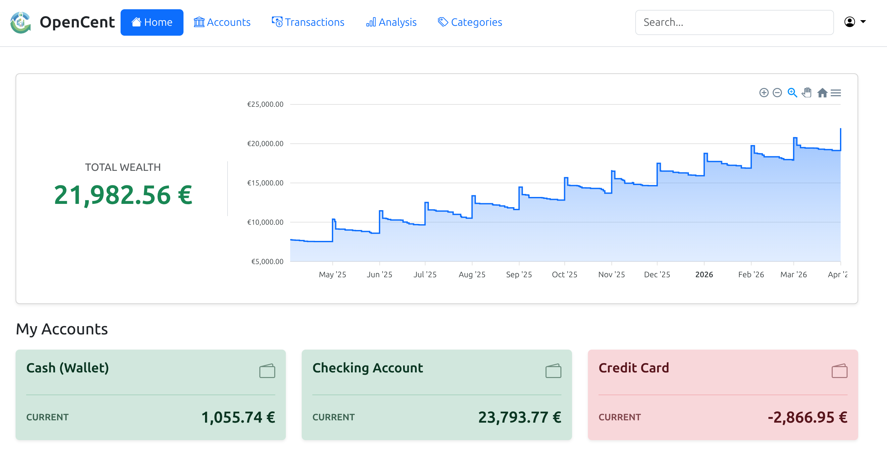
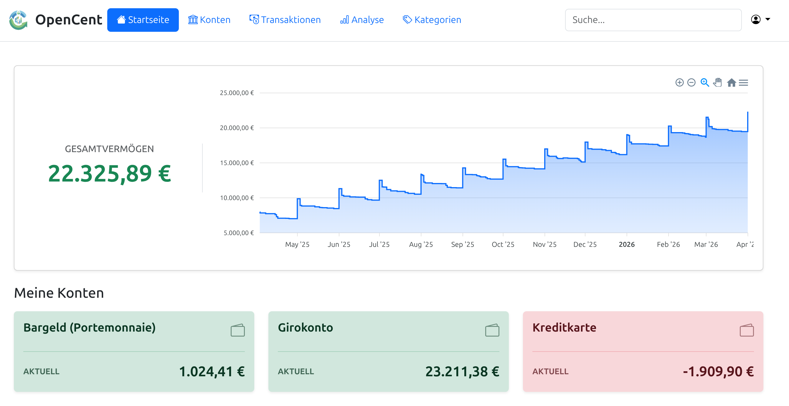

<div align="center">
  <a href="#-opencent-english">🇺🇸 Read in English</a> | 
  <a href="#-opencent-deutsch">🇩🇪 Auf Deutsch lesen</a>
</div>

<div id="-opencent-english"></div>

# 💸 OpenCent

**Your Finances. Your Data. Your Control.**

OpenCent is an **Open Source web application** for managing your personal finances. Similar to popular apps, but with one crucial difference: **Your data belongs to you.**

OpenCent runs on your own server (self-hosted), tracks your income and expenses across multiple accounts, and provides detailed analytics—without sharing any data with banks, trackers, or analytics companies.

<picture>
  <source media="(prefers-color-scheme: dark)" srcset="./docs/images/en-dashboard-dark.png">
  <source media="(prefers-color-scheme: light)" srcset="./docs/images/en-dashboard-light.png">
  
</picture>

## ✨ Features

OpenCent is designed to map real financial flows realistically and flexibly:

* **📊 Comprehensive Transaction Management**
    * Easily record income and expenses.
    * Clearly distinguish between real expenses and internal **transfers** between your own accounts.
    * **Split Transactions:** Divide a single receipt (e.g., supermarket) into multiple categories (e.g., groceries and drugstore items).
* **↩️ Smart Refunds**
    * Received a refund for a return? OpenCent calculates this correctly: The refund won't artificially inflate your income, and the original expense won't distort your statistics.
* **💳 Multi-Account & Cash**
    * Manage any number of accounts (checking, savings, credit cards).
    * Keep a dedicated **cash account** to keep track of physical expenses.
* **📈 Powerful Analytics & Dashboards**
    * **Sankey Diagrams:** See at a glance where your money comes from and where it goes.
    * **Expense Heatmap:** Discover patterns and find out on which days and in which months you spend the most money.
    * Interactive comparisons of categories and time trends.
* **🎨 Modern UI & Accessibility**
    * Full **Dark Mode** support.
    * Available in **English and German**.

## 🚀 Installation via Docker

You can quickly and easily install OpenCent via Docker for production use:

**1. Install Docker** (see [Docker Documentation](https://docs.docker.com/engine/install/)).

**2. Download Configuration Files**

```bash
curl -O https://raw.githubusercontent.com/jjk4/opencent/refs/heads/main/docker-compose.yml
curl -o .env https://raw.githubusercontent.com/jjk4/opencent/refs/heads/main/.env.docker.example
```

**3. Adjust the .env File**

Open the `.env` file and replace the `SECRET_KEY`. You can generate a secure key like this:
```bash
python3 -c "import secrets; print(secrets.token_urlsafe(50))"
```
Also, adjust the database password `DATABASE_PASSWORD`.

**4. Start the Application**

```bash
docker-compose up -d
```
Open your browser and navigate to `http://YOUR_SERVER_IP:8000`.

### 🧪 Generate Demo Data
To avoid testing OpenCent with an empty dashboard, the app comes with a test data generator. It creates a full year of realistic transactions, categories, and transfers:

```bash
# For English test data:
docker-compose exec opencent python manage.py generate_testdata --lang en
```
*(The credentials for the test account are: `testuser` / `testpass123`)*

## 💻 Development Setup

Want to contribute to OpenCent? Here is how to set up the application locally without Docker:

```bash
git clone https://github.com/jjk4/opencent.git
cd opencent
python3 -m venv venv
source venv/bin/activate
pip install -r requirements.txt
python manage.py migrate
python manage.py runserver
```
---

<div id="-opencent-deutsch"></div>

# 💸 OpenCent

**Deine Finanzen. Deine Daten. Deine Kontrolle.**

OpenCent ist eine **Open Source Webanwendung** zur Verwaltung deiner persönlichen Finanzen. Ähnlich wie populäre Apps, aber mit einem entscheidenden Unterschied: **Deine Daten gehören dir.**

OpenCent läuft auf deinem eigenen Server (Self-Hosted), trackt deine Einnahmen und Ausgaben über mehrere Konten hinweg und bietet detaillierte Analysen – ganz ohne Datenweitergabe an Banken, Tracker oder Analysefirmen.

<picture>
  <source media="(prefers-color-scheme: dark)" srcset="./docs/images/de-dashboard-dark.png">
  <source media="(prefers-color-scheme: light)" srcset="./docs/images/de-dashboard-light.png">
  
</picture>

## ✨ Funktionen

OpenCent wurde entwickelt, um echte Finanzströme realistisch und flexibel abzubilden:

* **📊 Umfassendes Transaktionsmanagement**
    * Einfaches Erfassen von Einnahmen und Ausgaben.
    * Unterscheide klar zwischen echten Ausgaben und internen **Umbuchungen** zwischen deinen Konten.
    * **Split-Transaktionen:** Teile einen Kassenbon (z.B. Supermarkt) auf mehrere Kategorien (z.B. Lebensmittel und Drogerie) auf.
* **↩️ Intelligente Rückerstattungen**
    * Du hast eine Rückzahlung für eine Retoure erhalten? OpenCent verrechnet diese korrekt: Die Erstattung bläht dein Einkommen nicht künstlich auf und die ursprüngliche Ausgabe verfälscht deine Statistik nicht.
* **💳 Multi-Account & Bargeld**
    * Verwalte beliebig viele Konten (Girokonto, Tagesgeld, Kreditkarte).
    * Führe ein dediziertes **Bargeldkonto**, um auch physische Ausgaben im Blick zu behalten.
* **📈 Mächtige Analysen & Dashboards**
    * **Sankey-Diagramme:** Zeigen dir auf einen Blick, woher dein Geld kommt und wohin es fließt.
    * **Ausgaben-Heatmap:** Erkenne Muster und finde heraus, an welchen Tagen und in welchen Monaten du das meiste Geld ausgibst.
    * Interaktive Vergleiche von Kategorien und zeitlichen Verläufen.
* **🎨 Modern UI & Accessibility**
    * Vollständiger **Dark Mode** Support.
    * Verfügbar auf **Deutsch und Englisch**.

## 🚀 Installation via Docker

Du kannst OpenCent schnell und einfach via Docker für den produktiven Einsatz installieren:

**1. Installiere Docker** (siehe [Docker Dokumentation](https://docs.docker.com/engine/install/)).

**2. Konfigurationsdateien herunterladen**

```bash
curl -O https://raw.githubusercontent.com/jjk4/opencent/refs/heads/main/docker-compose.yml
curl -o .env https://raw.githubusercontent.com/jjk4/opencent/refs/heads/main/.env.docker.example
```

**3. Passe die .env Datei an**

Öffne die `.env` Datei und ersetze den `SECRET_KEY`. Einen sicheren Schlüssel generierst du so:
```bash
python3 -c "import secrets; print(secrets.token_urlsafe(50))"
```
Passe außerdem das Datenbankpasswort `DATABASE_PASSWORD` an.

**4. Starte die Anwendung**

```bash
docker-compose up -d
```
Öffne deinen Browser und navigiere zu `http://IP_DEINES_SERVERS:8000`.

### 🧪 Demo-Daten generieren
Damit du OpenCent nicht mit einem leeren Dashboard testen musst, bringt die App einen Testdaten-Generator mit. Dieser erstellt ein komplettes Jahr an realistischen Transaktionen, Kategorien und Umbuchungen:

```bash
# Für deutsche Testdaten:
docker-compose exec opencent python manage.py generate_testdata --lang de
```
*(Die Zugangsdaten für den Test-Account lauten: `testuser` / `testpass123`)*

## 💻 Development Setup

Möchtest du an OpenCent mitentwickeln? So startest du die App lokal ohne Docker:

```bash
git clone https://github.com/jjk4/opencent.git
cd opencent
python3 -m venv venv
source venv/bin/activate
pip install -r requirements.txt
python manage.py migrate
python manage.py runserver
```

## 🛠️ Tech Stack

* **Backend:** Python, Django
* **Database:** PostgreSQL (Production) / SQLite (Dev)
* **Frontend:** HTML5, CSS3, JavaScript, ApexCharts, Bootstrap 5
* **Deployment:** Docker & Docker Compose

## 📄 License
Distributed under the GNU General Public License v3.0 License. See `LICENSE` for more information.